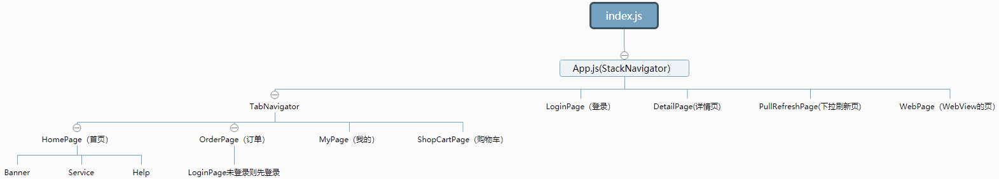
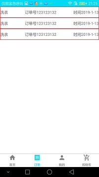
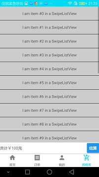
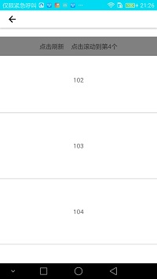
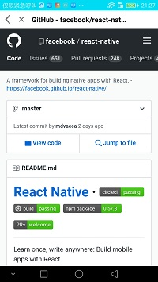

# WashClothes
React Native 练习

项目骨架基本有了

## 涵盖内容
本项目主要练习了以下内容 

flexbox 布局 View Image Text FlatList 下拉刷新， WebView 等基础

react-navigation 路由导航 包括 stack 和 tab 导航

react-native-vector-icon 图标字体

react-native-swipe-list-view 侧滑删除

如何组织代码

如何封装网络请求

如何使用在子目录中使用 index.js 文件

## 架构图

## 截屏

主界面 未做交互

订单界面 可以下拉刷新，点击订单行可以打开下拉刷新界面

我的界面 可以点击头像打开登录界面， 可以点击客服电话按钮打开拨号界面，可以点击鸣谢打开 github 网页

购物车界面 演示了侧滑删除

登录界面  演示了网络请求

下拉刷新界面  可以下拉刷新 上拉加载更多

网页界面  演示webview的使用， 从我的界面鸣谢打开
## 致谢
本项目 主要学习了后盾人深水鱼老师的 React Native 教程， B站只有视频，其代码和课件在 https://gitee.com/houdunren/react-native

React Native 中文网 https://reactnative.cn/